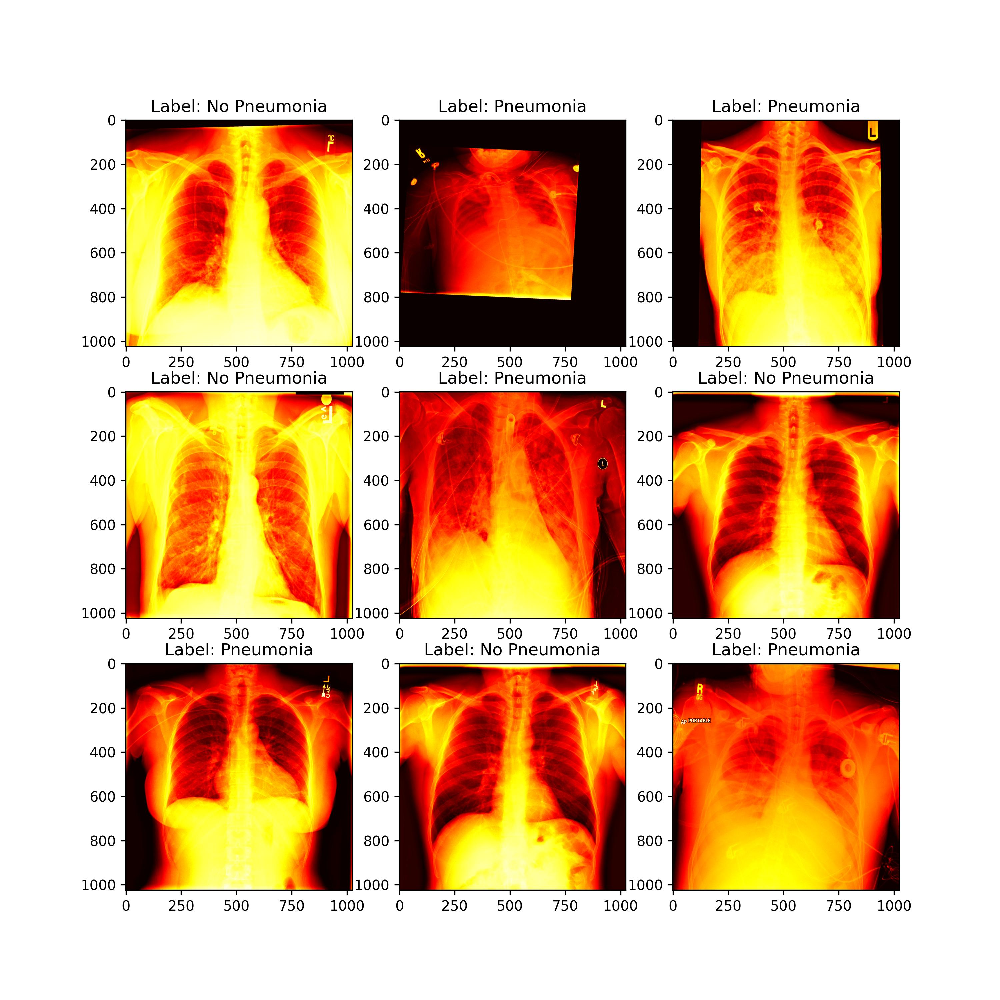
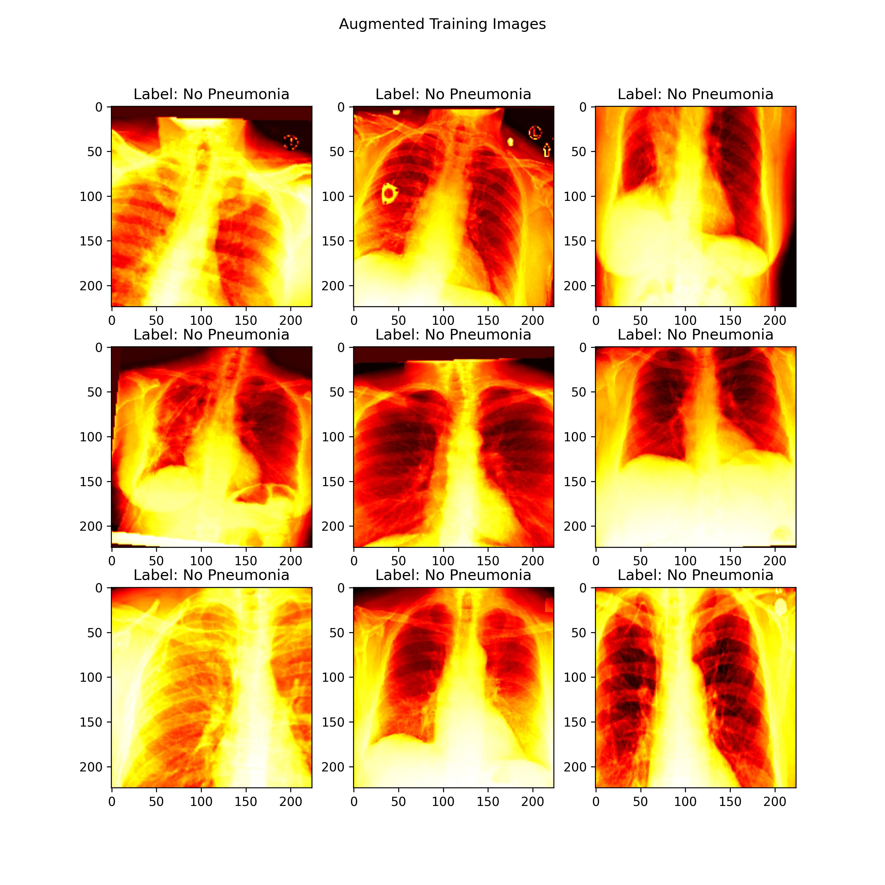

# medical_imaging_DeepLearning_Projects

Deep Learning using medical imagery [X-ray | CT | MRI | PET]

Repository for deep learning projects focused on image classification and segmentation using medical data.

By Myles McKay(@mmckay18),

<!--  -->

# Table of Contents

<!-- - [Introduction](#introduction)
- [Research Abstract](#research-abstract)
- [Data](#data)
  - [Data Sources](#data-sources)
  - [Data Acquisition](#data-acquisition)
  - [Data Preprocessing](#data-preprocessing)
- [Results and Evaluation](#results-and-evaluation)
- [Visualization](#visualization)
- [Future Work](#future-work)
- [References](#references) -->
<!-- - [License](#license) -->

# Introduction

This repo hosts medical imaging classification and segmentation projects to showcase my background in deep learning. I use X-ray, MRI, CT, and PET imaging data for these projects and have extensive training on using DICOM and NiFTI files.

# X-ray Classification

## Data

X-ray data source: https://www.kaggle.com/competitions/rsna-pneumonia-detection-challenge/data

### Raw X-ray Image Data Visualization

_Figure 1: Raw training images used for X-ray pneumonia classification. These images are not normalized nor standardized. In this project, I have train and test directories with subdirectories 0 and 1 representing no pneumonia and pneumonia respectively The validatiion set is a fraction of the training set._

## Data Preprocessing

- Resize the images to 224x224
- Normalize intensity scale using sums of sums and sums squared
- Standardize the values by computing the mean and standard deviation of the sums and sums squared

### Normalization

I applied normalization by computing the sum and sum of squares of the pixel values for each image, where the normalizer 224×224 accounts for the image resizing during training. The goal is to achieve a consistent intensity distribution across images ranging from 0 to 255.

#### **Sum:**

$$
\sum X = \sum_{i=1}^{N} \frac{\text{Processed\_dcm\_array}_i}{224 \times 224}
$$

#### **Sum of Squares:**

$$
\sum X^{2} = \sum_{i=1}^{N} \left(\frac{\text{Processed\_dcm\_array}_i}{224 \times 224}\right)^2
$$

### Standardization

I apply standardization to center the pixel values around 0 and scale them based on variance. First, I use min-max normalization to convert the pixel values from the range [0, 255] to [0, 1]. Then, I apply scaling to transform the pixel values to the range [-1, 1], by computing the mean and standard deviation from the sum of sums and sum of squares.

#### Mean:

$$
\mu = \frac{\sum X}{24000}
$$

#### Standard Deviation:

$$
\sigma = \sqrt{\frac{\sum X^{2}}{24000} - \mu^2}
$$

## Data Augmentation

I applied various augmentations that adjust orientation, scale, and shift to enhance the model's robustness in detecting pneumonia, regardless of the patient's positioning.

_Figure 2: Augmented training images._

## Model Evaluation
